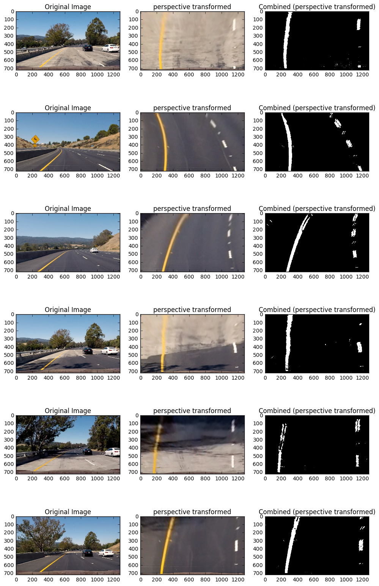
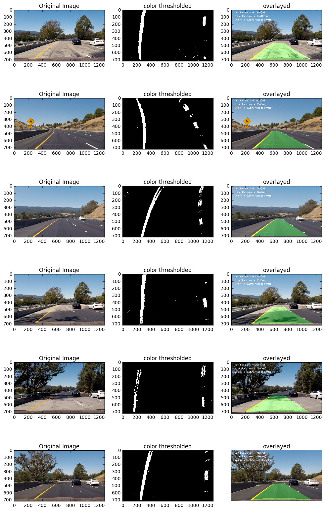

## Advanced Lane Finding
[](http://www.udacity.com/drive)
This project really challenged me and I really enjoyed working on it. In some ways it was complex and in others simple solution to complex issues did the best job.

The goals / steps of this project are the following:
1 Compute the camera calibration matrix and distortion coefficients given a set of chessboard images.
2 Apply the distortion correction to the raw image.
3 Apply a perspective transform to rectify binary image ("birds-eye view").
4 Use color transforms, gradients, etc., to create a thresholded binary image.
5 Detect lane pixels and fit to find lane boundary.
6 Determine curvature of the lane and vehicle position with respect to center.
7 Warp the detected lane boundaries back onto the original image.
8 Output visual display of the lane boundaries and numerical estimation of lane curvature and vehicle position.

### Steps 1 and 2: *Compute camera calibration and apply it*
This was a simple task. I used lecture notes to figure out calibration for the camera. I used ```cv2.findChessboardCorners``` and ```cv2.calibrateCamera``` to achieve this.

I read all the calibration files from ```camera_cal``` folder, convert them to grayscale and use ```cv2.findChessboardCorners``` to get corners. I store these values in an array and pass it to ```cv2.calibrateCamera``` getting values various cameraMatrix and distCoeffs.

I pass distortion Coefficients and camera Matrix to ```cv2.undistort``` to get undistorted images


### Steps 3: *Apply a perspective transform to rectify binary image ("birds-eye view").*
The idea was to use ```cv2.getPerspectiveTransform``` and ```cv2.warpPerspective``` by passing in an undistorted image from earlier and src and dst pixel points.

Choosing the src and dst points for some reason turned out to be an interesting exercise. I wanted to get birds eye view which meant to choose src pixels that created an <b>Isosceles trapezoid</b> and then stretch it to make a square. After trying umpteen variations the ones that I felt did the best jobs where

```
src = np.float32([(300, 720),(580, 470),(730, 470),(1100, 720)])
dst = np.float32([(300, 720),(300, 0),(1100, 0),(1100, 720)])
```


### Steps 4: *Use color transforms, gradients, etc., to create a thresholded binary image.*
This piece played the most important role in detecting pixels for left and right lines. I had to figure out ways to single out yellow and white colors in images to easily identify the lines. I started using what was suggested in the class notes and seemed to work, but i soon recognized I had issues in shaded areas or where the color of the road changed.

I tried various combinations or channels, thresholds, which you can see in the crazy number of github commits. In some cases it looked like I had recognized the lines well (really thick) but when using the histogram approach it would not line up well.

One thing was clear, a thresholded s channel and taking sobel transform around x and y axis would be critical here.

I created a method ```color_transform_n_threshold``` and the implementation that worked for me was to use a stacked image where i had extracted yellow, white and s channel from rgb, hsv and hls formats of the incoming image. I stacked this with thresholded(sx_thresh=(30, 255)) sobel on x and y axis and a thresholded(s_thresh=(170, 255)) s channel.

*I tried god knows how many variations of this and it was frustrating. This makes me think that color transform in snowy conditions etc to recognize lines will not really work. It works for the sample video but makes me wonder how complex can this get?*.

```bit_layer = s_ch_binary | sobelx | sobely | yellow_rgb | yellow_hsv | yellow_hls | white_rgb | white_hsv | white_hls```




### Steps 5 and 6: *Detect lane pixels and fit to find lane boundary. and Determine curvature of the lane and vehicle position with respect to center.*
This was by far the most trickiest piece for me. Apart from getting the approach right I had to go back and forth on color transform and this step to make sure I was getting the pixels recognized corrrectly. I overthought this step so much. The answer was simple which I will explain later.

##### *Incorrect approaches to detecting lines*
1. I started by creating row strips (100) of the incoming image and doing histogram of each strip. Initially i used the method ```np.argmax``` to get the left line pixel and then adding a arbitray <b>640 pixel</b> value to get the right line pixel. This created a mess of <if, then, else> as I had to check to make sure pixels were not going outside the image etc and hardcoding them to a starting point.

2. The above approach was clearly not disirable. I went thru the material again and realized that the suggestion was to get a starting bottom pixel values for left and right lines using a histogram of half the image. I used ```np.array(scipy.signal.find_peaks_cwt(histogram, np.array([200])))``` to get the starting left and right line pixels. I did this but for some reason was stuck on how to get a sliding window approach going. I thought the suggestion was to continue doing histograms of image slices(rows) and used the same peak method (```np.array(scipy.signal.find_peaks_cwt(histogram, np.array([200])))```). This obviously created problems as it was inrecdibly slow and also in some slices would recognize more than two peaks, leading me to hard code which peak to choose for left and right pixel values for left and right lines respectively.

3. Building on 2, and reading the material again I realized the suggestion was to only take a window of the image for left and right lines. I did that but was still doing histograms and failed again.

##### *Correct approach detecting lines*
The approach that worked and required no hard coding was simple and the fastest. It was explained in the material but for some reason as I had said earlier I wanted a more complex solution.
The method ```transpose_line``` did two things, which sort of violates the single responsibility principle.
* Detect and left and right line pixels.
..* I start by taking a histogram of 60% of the image(half missed starting pixels on some images). I take the midpoint and find the left peak by using ```argmax``` for the image from 0 column to the middle. I repeat this from midpoint to last column to give me right peak. These two peaks now are starting pixel points for the left and right image.
..* I now slice the image into strips along rows and create a sliding window at the starting pixel for the left line. I deduct 50 pixel and add 50 pixel to the starting left line pixel to give me a start_col and end_col for the window that I am going to search for pixels for the left line. If I find pixels I take a mean of all the pixel found and make that value as the new starting position for sliding window for the next slize. I repeat this process to get all the pixel on the left line.
..* I follow the same steps as above point for the right line as well.
..* I also mark the middle pixel for both left(```middle_px_left_lane```) and right(```middle_px_right_lane```) line at the 50th slice (i am taking 100 horizontal slices of the image)

The above sliding window appoach gives me all the pixels accurately enough.

##### *Fitting the pixels to a second order polynomial*
Once the pixels are found for both left and right lines, I used the following methods to get a fit on second order polynomial
```
    # Fit a second order polynomial to each lane line
    left_fit = np.polyfit(ycord_left_line, xcord_left_line, 2)
    left_fitx = left_fit[0] * ycord_left_line ** 2 + left_fit[1] * ycord_left_line + left_fit[2]

    right_fit = np.polyfit(ycord_right_line, xcord_right_line, 2)
    right_fitx = right_fit[0] * ycord_right_line ** 2 + right_fit[1] * ycord_right_line + right_fit[2]
```

To find the curvature of the lines, I used suggestions provided by the class notes
```
    ym_per_pix = 30/720 # meters per pixel in y dimension
    xm_per_pix = 3.7/700 # meteres per pixel in x dimension
    y_eval_left = np.max(ycord_left_line)
    y_eval_right = np.max(ycord_right_line)

    left_fit_cr = np.polyfit(ycord_left_line*ym_per_pix, xcord_left_line*xm_per_pix, 2)
    right_fit_cr = np.polyfit(ycord_right_line*ym_per_pix, xcord_right_line*xm_per_pix, 2)

    left_curverad = ((1 + (2*left_fit_cr[0]*y_eval_left + left_fit_cr[1])**2)**1.5) \
                             /np.absolute(2*left_fit_cr[0])
    right_curverad = ((1 + (2*right_fit_cr[0]*y_eval_right + right_fit_cr[1])**2)**1.5) \
                                /np.absolute(2*right_fit_cr[0])
```

I calculate the middle of the lane line like so
```
lane_middle = int((middle_px_right_lane - middle_px_left_lane)/2.)+middle_px_left_lane
```

Once I had the lane_middle, a right and left polynomial fit, and curvature values, I return all of these from this method ```transpose_line```

I could have used a LineObject to hold all these values, but felt I didn't really need that. OO practices will tell you to not have methods that return that many values but it seemed ok to me personally.

### Step 7: Warp the detected lane boundaries back onto the original image.
I created a method drawlines that takes a color & perspective transofmed image, the left and right pixel fitted to a second order polynomial from earlier step., source and destination points for reverse perspective transform, the original image, undistroted version of the image, curvature values and lane middle

The method first creates a blank image. I draw left and right lines using cv2.fillPoly on this blank image. I reverse perspective tranform this image

Finally I combine the reverse perspective transformed image with the undistorted image.

I also write all the information in panel on the image regarding curvature and departure from the middle lane.

I return the final result.

```
def drawlines(transformed, left_fitx, ycord_left_line, right_fitx, ycord_right_line, src, dst, image, undst, left_curverad, right_curverad, lane_middle):
    # Create an image to draw the lines on
    warp_zero = np.zeros_like(transformed).astype(np.uint8)
    color_warp = np.dstack((warp_zero, warp_zero, warp_zero))

    # Recast the x and y points into usable format for cv2.fillPoly()
    pts_left = np.array([np.transpose(np.vstack([left_fitx, ycord_left_line]))])
    pts_right = np.array([np.flipud(np.transpose(np.vstack([right_fitx, ycord_right_line])))])
    pts = np.hstack((pts_left, pts_right))

    # Draw the lane onto the warped blank image
    cv2.fillPoly(color_warp, np.int_([pts]), (0,255, 0))

    # Warp the blank back to original image space using inverse perspective matrix (Minv)
    newwarp = perspective_transform(color_warp, dst, src , (image.shape[1], image.shape[0]))
    # Combine the result with the original image
    result = cv2.addWeighted(undst, 1, newwarp, 0.3, 0)

    font = cv2.FONT_HERSHEY_SIMPLEX
    cv2.putText(result, 'Left line curve = %d(m)' % left_curverad, (50,50), font, 1,(255,255,255),2)
    cv2.putText(result, 'Right line curve = %d(m)' % right_curverad, (50,100), font, 1,(255,255,255),2)
    if (lane_middle-640 > 0):
        offset = ((lane_middle-640)/640.*(3.66/2.))
        left_or_right = "right"
    else:
        offset = ((lane_middle-640)/640.*(3.66/2.))*-1
        left_or_right = "left"
    left_or_right = 'left' if offset < 0 else 'right'
    cv2.putText(result, 'Vehicle is %.2fm %s of center' % (np.abs(offset), left_or_right), (50,150), font, 1,(255,255,255),2)

    return result

 ```



### Step 8: Output
I wrote a pipeline method that takes a image combines all the methods above to give me a returned image that has lines detected and drawn on it.
The method
1. undistorts the image
2. does a color tranform
3. does a perspective tranform
4. detects lines, middle and curvature
5. drawslines and reverts the perspective transform
6. returns a final image with all the details

```
def pipeline(image):
    undst = cv2.undistort(image, mtx, dist, None, mtx)

    s_b, combined_b = color_transform_n_threshold(image)
    #s_b_transformed = perspective_transform(s_b, src, dst, (s_b.shape[1], s_b.shape[0]))
    combined_b_transformed = perspective_transform(combined_b, src, dst, (combined_b.shape[1], combined_b.shape[0]))

    left_fitx, ycord_left_line, right_fitx, ycord_right_line, left_curverad, right_curverad = transpose_line(combined_b_transformed)
    r = drawlines(combined_b_transformed, left_fitx, ycord_left_line, right_fitx, ycord_right_line, src, dst, image, undst)
    return r
```

The pipeline method is fed by taking the video clip and takeing each frame and passing it to the method pipeline like so
```
clip1 = VideoFileClip("project_video.mp4")
project_clip = clip1.fl_image(pipeline)

%time project_clip.write_videofile('project_video_updated.mp4', audio=False)
```

